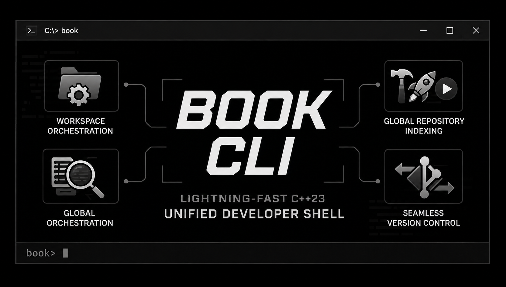
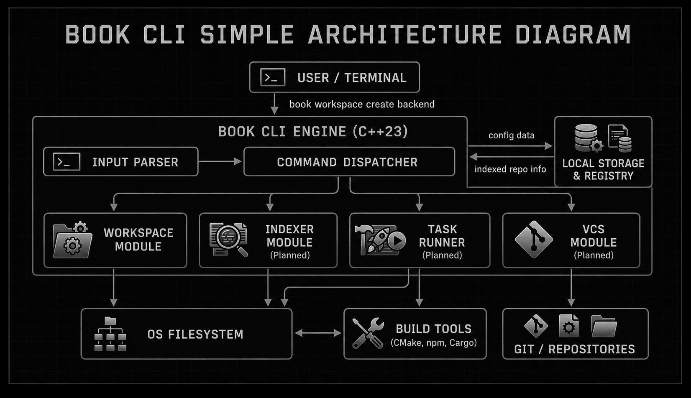

# Book CLI

**Book CLI is a lightning-fast C++23 developer tool designed to unify your entire workflow. It instantly creates and manages workspaces, indexes your local repositories for fast searching, runs your build/test tasks, and handles Git version control—all from a single, persistent terminal.**

<div align="center">
  
  <br/>
</div>

## Overview

A standard developer workflow is heavily fragmented. Switching between projects usually means typing out long absolute paths, juggling multiple terminal windows to run servers and manage files, and constantly trying to remember if a specific directory uses `npm`, `cmake`, or `cargo`. Every time you switch contexts, it breaks your focus.

Book CLI acts as a project-aware master shell that removes this friction entirely. Instead of fighting your environment, you stay in one unified interface. You simply tell Book CLI what you want to do—whether that is jumping to a workspace, building the current project, or committing code—and it natively handles the underlying OS commands, paths, and toolchains for you.

## Core Features (v0.9 Roadmap)

### Workspace Orchestration (Active - v0.2)
Forget raw file paths. Book CLI lets you define and jump between your development environments instantly.
* `workspace create <name>` - Scaffolds a new workspace instantly.
* `workspace open <name>` - Teleports your shell directly to the target project.
* `workspace list` / `workspace remove` - Safely manages your local directories.

### Global Repository Indexing (Upcoming)
Never lose a project directory again.
* **Smart Scanning:** Multi-threaded indexing (`scan --global`) finds every developer project on your machine.
* **Instant Search:** Sub-millisecond fuzzy search (`search <query>`) lets you jump to any repository instantly.

### Unified Task Runner (Upcoming)
Stop memorizing build scripts. Book CLI detects the active project type and abstracts the execution.
* **Auto-Build:** Run `build` and the CLI automatically triggers the correct toolchain (CMake, Rust, Node).
* **Test & Run:** Instantly execute `test` or `run` without looking up the specific package scripts.

### Seamless Version Control (Upcoming)
Manage your Git workflow directly from the master shell.
* **Workspace Status:** Get a clean, instant summary of modified files and active branches.
* **Rapid Commits:** Stage and commit changes with a single `commit` command.

## System Architecture

<div align="center">
  
</div>
<br/>

Book CLI is built for absolute performance, leveraging modern **C++23** to directly manipulate the operating system with zero external runtime dependencies. 

**Current Subsystem Design:**
1. **Interactive REPL:** A persistent shell environment capturing user streams.
2. **Tokenization Engine:** Safely parses raw strings into whitespace-delimited argument vectors.
3. **Command Dispatcher:** Routes commands to isolated namespace handlers based on the initial token.
4. **Native FS Execution:** Command handlers utilize the C++23 `<filesystem>` standard to validate disk states and mutate directories fail-safe, without heavy heap allocations.

*For a deeper dive into the memory model and planned component expansions, read [ARCH.md](ARCH.md).*

## Getting Started

### Option 1: One-Line Install (Windows)
The fastest way to install Book CLI is via our automated PowerShell script. Open your terminal and paste:

```powershell
irm https://raw.githubusercontent.com/drdead0/Book_CLI/main/install.ps1 | iex
```
*Note: You may need to restart your terminal after installation for the `book` command to be globally recognized.*

### Option 2: Install via Windows Installer
You do not need to build from source to use Book CLI. 
1. Go to the [Releases](#) tab on GitHub.
2. Download the latest `Book CLI-win64.exe`.
3. Run the installer. It will automatically add `book` to your system PATH.
4. Open any command prompt and type `book` to enter the master shell.

### Option 3: Build from Source
If you wish to compile the project yourself, Book CLI requires a C++23 compatible compiler and CMake.

```bash
# 1. Clone the repository
git clone https://github.com/drdead0/Book_CLI.git
cd Book_CLI

# 2. Generate build files and compile in Release mode
cmake -B build
cmake --build build --config Release

# 3. Enter the shell
./build/book
```

## Usage Example

Once inside the `book>` prompt, your workflow takes over:
```text
book> workspace create backend-api
Success: Created workspace folder 'backend-api'

book> workspace open backend-api
Success: Opened workspace 'backend-api'

book> build
(CMake) Building backend-api... Success.
```

## Contributing

We are building the ultimate developer shell. If you want to contribute, check our issue-driven Git workflow and C++ coding standards in [CONTRIBUTING.md](CONTRIBUTING.md).

## License
This project is open-source and licensed under the **MIT License**.